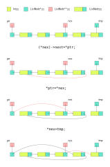

@import "/mystyle.less"

### [92\. 反转链表 II](https://leetcode-cn.com/problems/reverse-linked-list-ii/)

Difficulty: **中等**

给你单链表的头指针 `head` 和两个整数 `left` 和 `right` ，其中 `left <= right` 。请你反转从位置 `left` 到位置 `right` 的链表节点，返回 **反转后的链表** 。

**示例 1：**


```
输入：head = [1,2,3,4,5], left = 2, right = 4
输出：[1,4,3,2,5]
```

**示例 2：**

```
输入：head = [5], left = 1, right = 1
输出：[5]
```

**提示：**

*   链表中节点数目为 `n`
*   `1 <= n <= 500`
*   `-500 <= Node.val <= 500`
*   `1 <= left <= right <= n`

**进阶：** 你可以使用一趟扫描完成反转吗？


#### Solution

##### 提供一个指针的指针的解法

使用指针的指针来定位需要反转的位置和使用头插法操作反转，不需要建立头节点。



```cpp
​/**
 * Definition for singly-linked list.
 * struct ListNode {
 *     int val;
 *     ListNode *next;
 *     ListNode() : val(0), next(nullptr) {}
 *     ListNode(int x) : val(x), next(nullptr) {}
 *     ListNode(int x, ListNode *next) : val(x), next(next) {}
 * };
 */
class Solution {
public:
    ListNode* reverseBetween(ListNode* head, int left, int right) {
        // 取head指针的指针。
        ListNode** ptr = &head;
        left--;
        right--;

        // 移动head指针到需要反转的位置
        while(left > 0){
            left --;
            right --;
            ptr = &((*ptr)->next);
        }

        auto nex = &((*ptr)->next);
        
        // 操作头插法，可以看上面的示意图
        while(right--){
            auto tmp = (*nex)->next;
            (*nex)->next = *ptr;
            *ptr = *nex;
            *nex = tmp;
        }
        return head;
    }
};
```