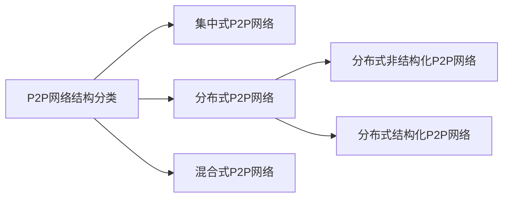

# 计算机网络的一些复习题

## :rocket:简答题

### :fire:什么是网络编码？它的核心思想是什么？与传统的多播路由有何区别？
> 参考1: [网络编码_百度百科](https://baike.baidu.com/item/网络编码/2654145)  参考2: [Network_Information_Flow](http://www.cs.cornell.edu/courses/cs783/2007fa/papers/acly.pdf)

网络编码是一种融合了路由和编码的信息交换技术，它的核心思想是在网络中的各个节点上对各条信道上收到的信息进行线性或者非线性的处理，然后转发给下游节点，中间节点扮演着编码器或信号处理器的角色。

根据图论中的最大流-最小割定理，数据的发送方和接收方通信的最大速率不能超过双方之间的最大流值(或最小割值)，如果采用传统多播路由的方法，一般不能达到该上界。R Ahlswede 等人以蝴蝶网络的研究为例，指出通过网络编码，可以达到多播路由传输的最大流界，提高了信息的传输效率，从而奠定了网络编码在现代网络通信研究领域的重要地位。

### :fire:简述射频识别技术的特点。
> 参考1：[射频识别技术_百度百科](https://baike.baidu.com/item/射频识别技术/9524139)

通常来说，射频识别技术具有如下特性：
- **适用性**：RFID技术依靠电磁波，并不需要连接双方的物理接触。这使得它能够无视尘、雾、塑料、纸张、木材以及各种障碍物建立连接，直接完成通信。
- **高效性**：RFID系统的读写速度极快，一次典型的RFID传输过程通常不到100毫秒。高频段的RFID阅读器甚至可以同时识别、读取多个标签的内容，极大地提高了信息传输效率。
- **独一性**：每个RFID标签都是独一无二的，通过RFID标签与产品的一一对应关系，可以清楚的跟踪每一件产品的后续流通情况。
- **简易性**：RFID标签结构简单，识别速率高、所需读取设备简单。尤其是随着NFC技术在智能手机上逐渐普及，每个用户的手机都将成为最简单的RFID阅读器。

### :fire:什么是Hadoop？它的核心架构是什么？
> 参考1：[Hadoop_百度百科](https://baike.baidu.com/item/Hadoop)

Hadoop是一个由Apache基金会所开发的分布式系统基础架构。用户可以在不了解分布式底层细节的情况下，开发分布式程序。充分利用集群的威力进行高速运算和存储。

**核心架构**

Hadoop 由许多元素构成。其最底部是 Hadoop Distributed File System（HDFS），它存储 Hadoop 集群中所有存储节点上的文件。HDFS的上一层是MapReduce 引擎，该引擎由 JobTrackers 和 TaskTrackers 组成。通过对Hadoop分布式计算平台最核心的分布式文件系统HDFS、MapReduce处理过程，以及数据仓库工具Hive和分布式数据库Hbase的介绍，基本涵盖了Hadoop分布式平台的所有技术核心。

- HDFS
- NameNode
- DataNode
- 文件操作
- Linux 集群

### :fire:简述软件定义网络的体系结构
> 参考：[软件定义网络_百度百科](https://baike.baidu.com/item/软件定义网络)

SDN的整体架构由下到上（由南到北）分为数据平面、控制平面和应用平面，具体下图所示。其中，数据平面由交换机等网络通用硬件组成，各个网络设备之间通过不同规则形成的SDN数据通路连接；控制平面包含了逻辑上为中心的SDN控制器，它掌握着全局网络信息，负责各种转发规则的控制；应用平面包含着各种基于SDN的网络应用，用户无需关心底层细节就可以编程、部署新应用。

控制平面与数据平面之间通过SDN控制数据平面接口（control-data-plane interface，简称CDPI）进行通信，它具有统一的通信标准，主要负责将控制器中的转发规则下发至转发设备，最主要应用的是OpenFlow协议。控制平面与应用平面之间通过SDN北向接口（northbound interface，简称NBI）进行通信，而NBI并非统一标准，它允许用户根据自身需求定制开发各种网络管理应用。

SDN中的接口具有开放性，以控制器为逻辑中心，南向接口负责与数据平面进行通信，北向接口负责与应用平面进行通信，东西向接口负责多控制器之间的通信。最主流的南向接口CDPI采用的是OpenFlow协议。OpenFlow最基本的特点是基于流（Flow）的概念来匹配转发规则，每一个交换机都维护一个流表（Flow Table），依据流表中的转发规则进行转发，而流表的建立、维护和下发都是由控制器完成的。针对北向接口，应用程序通过北向接口编程来调用所需的各种网络资源，实现对网络的快速配置和部署。东西向接口使控制器具有可扩展性，为负载均衡和性能提升提供了技术保障。

### :fire:与传统的网络应用模式相比，云计算具有哪些优势和特点？
> 参考：[云计算_百度百科](https://baike.baidu.com/item/云计算/9969353)

云计算的可贵之处在于高灵活性、可扩展性和高性比等，与传统的网络应用模式相比，其具有如下优势与特点：
- **虚拟化技术**。必须强调的是，虚拟化突破了时间、空间的界限，是云计算最为显著的特点，虚拟化技术包括应用虚拟和资源虚拟两种。众所周知，物理平台与应用部署的环境在空间上是没有任何联系的，正是通过虚拟平台对相应终端操作完成数据备份、迁移和扩展等。
- **动态可扩展**。云计算具有高效的运算能力，在原有服务器基础上增加云计算功能能够使计算速度迅速提高，最终实现动态扩展虚拟化的层次达到对应用进行扩展的目的。
- **按需部署**。计算机包含了许多应用、程序软件等，不同的应用对应的数据资源库不同，所以用户运行不同的应用需要较强的计算能力对资源进行部署，而云计算平台能够根据用户的需求快速配备计算能力及资源。
- **灵活性高**。目前市场上大多数IT资源、软、硬件都支持虚拟化，比如存储网络、操作系统和开发软、硬件等。虚拟化要素统一放在云系统资源虚拟池当中进行管理，可见云计算的兼容性非常强，不仅可以兼容低配置机器、不同厂商的硬件产品，还能够外设获得更高性能计算。
- **可靠性高**。倘若服务器故障也不影响计算与应用的正常运行。因为单点服务器出现故障可以通过虚拟化技术将分布在不同物理服务器上面的应用进行恢复或利用动态扩展功能部署新的服务器进行计算。
- **性价比高**。将资源放在虚拟资源池中统一管理在一定程度上优化了物理资源，用户不再需要昂贵、存储空间大的主机，可以选择相对廉价的PC组成云，一方面减少费用，另一方面计算性能不逊于大型主机。
- **可扩展性**。用户可以利用应用软件的快速部署条件来更为简单快捷的将自身所需的已有业务以及新业务进行扩展。如，计算机云计算系统中出现设备的故障，对于用户来说，无论是在计算机层面上，亦或是在具体运用上均不会受到阻碍，可以利用计算机云计算具有的动态扩展功能来对其他服务器开展有效扩展。这样一来就能够确保任务得以有序完成。在对虚拟化资源进行动态扩展的情况下，同时能够高效扩展应用，提高计算机云计算的操作水平。

### :fire:简述移动IPv4的基本工作过程
> 参考：[计算机网络高级编程（第2版）吴功宜](https://item.jd.com/11768206.html) 第432页

移动IPv4的基本工作过程大致可以分为代理发现、注册、分组路由和注销4个阶段。

- **代理发现(agent discovery)**
移动IPv4代理发现是通过扩展ICMP路由发现机制实现的。它定义了“代理通告”和“代理请求”两种新的报文。
移动代理工作周期性地发送代理通告报文，或为响应移动节点的代理请求而发送代理通告报文。移动节点在接收到代理通告报文后，判断它是否从一个网络切换到另一个网络，是在家乡网络还是在外地网络。在切换到外地网络时，可以选择使用外地代理提供的转交地址。
- **注册(registration)**
移动节点到达新的网络后，通过注册过程把自己新的可达信息通知家乡代理。注册过程设计移动节点、外地代理和家乡代理。通过交换注册报文，在家乡代理上创建或者修改“移动绑定”，使家乡代理在规定的生存期内保持移动节点的家乡地址与转发地址的关联。
- **分组路由(packet routing)**
移动IP的分组路由可以分成单播、广播与多播3种情况来进行讨论。
  - **单播分组路由**。单播分组路由可以分为两种情况。第一种情况是：移动节点在外地网络上接收单播分组。在移动IPv中，与移动节点通信的节点使用移动节点的IP地址所发送的数据分组，首先会被传送到家乡代理。家乡代理判断目的主机已经在外地网络访问，它会利用隧道将数据分组发送到外地代理，有外地代理最后发送给移动节点。第二种情况是：移动节点在外地网络上发送单播分组。如果移动节点向通信对端发送数据分组，那么它就有两种方法。一种方法是通过外地代理直接路由到目的主机；另一种方法是通过家乡代理转发。
  - **广播分组路由**。一般情况下，家乡代理不将广播数据分组转发到移动绑定列表中的每一个移动节点。如果移动节点已经请求转发广播数据分组，那么家乡代理将采取“IP封装”的方法实现转发。
  - **多播分组路由**。多播分组路由也分为两种情况。第一种情况是移动节点接收多播数据分组。移动节点接收多播数据分组有两种方法。第一种方法是移动节点直接通过外地网络的多播路由器加入多播组。第二种方法是通过和家乡代理之间建立的双向隧道加入多播组，移动节点将IGMP报文通过反向隧道发送到家乡代理，家乡代理通过隧道将多播数据分组发送到移动节点。第二种情况是移动节点发送多播数据分组。移动节点如果是多播源，那么它发送多播数据分组也有两种方法。第一种方法是移动节点直接通过外地网络的多播路由器发送多播分组。第二种方法是先将多播分组发送到家乡代理，家乡代理再将多播数据分组转发送出去。
- **注销(deregistration)**
如果移动节点已经回到家乡网络，那么它需要向家乡代理进行注销。

### :fire:简述无线mesh网络的结构
> 参考： [无线mesh网络_百度百科](https://baike.baidu.com/item/%E6%97%A0%E7%BA%BFMesh%E7%BD%91%E7%BB%9C/8614112)

无线Mesh网络是一种与传统的无线网络完全不同的网络。传统的无线接入技术中，主要采用点到点或者点到多点的拓扑结构。这种拓扑结构中一般都存在一个中心节点，例如移动通信系统中的基站、802.11无线局域网(WLAN)中的接入点(AP)等等。中心节点与各个无线终端通过单跳无线链路相连，控制各无线终端对无线网络的访问；同时，又通过有线链路与有线骨干网相连，提供到骨干网的连接。而在无线Mesh网络中，采用网状Mesh拓扑结构，是一种多点到多点网络拓扑结构。在这种Mesh网络结构中，各网络节点通过相邻其他网络节点，以无线多跳方式相连。

在WMN中包括两种类型的节点：无线Mesh路由器和无线Mesh用户端。WMN的系统结构根据节点功能的不同分为3类：骨干网Mesh结构、客户端Mesh结构、混合结构。

骨干网Mesh结构是由Mesh路由器网状互连形成的，无线Mesh骨干网再通过其中的Mesh路由器与外部网络相连。Mesh路由器除了具有传统的无线路由器的网关、中继功能外，还具有支持Mesh网络互连的路由功能，可以通过无线多跳通信，以低得多的发射功率获得同样的无线覆盖范围。

客户端Mesh结构是由Mesh用户端之间互连构成一个小型对等通信网络，在用户设备间提供点到点的服务。Mesh网用户终端可以是手提电脑、手机、PDA等装有无线网卡、天线的用户设备。这种结构实际上就是一个Ad hoc网络，可以在没有或不便使用现有的网络基础设施的情况下提供一种通信支撑。

Mesh客户端可以通过Mesh路由器接入骨干Mesh网络形成Mesh网络的混合结构，其中虚线和实线分别表示无线和有线连接。这种结构提供与其他一些网络结构的连接，增强了连接性，扩大了覆盖范围。

### :fire:简述容迟网络的主要特点
> 参考：[容迟容忍网络_百度百科](https://baike.baidu.com/item/%E5%BB%B6%E8%BF%9F%E5%AE%B9%E5%BF%8D%E7%BD%91%E7%BB%9C)

DTN网络近年来在学术领域得到了越来越多的重视，究其原因，是因为它有着与传统因特网不同的一些特点，这些特点违背了因特网相关协议的一些基本假设，从而使人们不得不重新设计适用于DTN网络上的网络协议。这些特点包括： 
- 网络延时大。比如外太空网络中，消息的传播时间通常在分钟数量级以上。
- 连接不稳定。由于节点的移动性、失效、遭受攻击、休眠调度或自身能量考虑，节点之间的连接通常是间断性的。
- 非对称的链路传输速率。
- 数据传输的高误码率和差错率。由于节点的移动性和连接不稳定性，分组的丢包概率较传统因特网也大大增加。

### :fire:简述多协议标签交换的工作原理
> 参考：[多协议标签交换_维基百科](https://zh.wikipedia.org/wiki/%E5%A4%9A%E5%8D%8F%E8%AE%AE%E6%A0%87%E7%AD%BE%E4%BA%A4%E6%8D%A2)

当一个未被标记的分组（IP包、帧中继或ATM信元）到达MPLS LER时，入口 LER根据输入分组头查找路由表以确定通向目的地的标记交换路径LSP，把查找到的对应LSP的标记插入到分组头中，完成端到端IP地址与MPLS标记的映射。  

分组头与label的映射规则不但考虑数据流目的地的信息，还考虑了有关QoS的信息；在以后网络中的转发，MPLS LSR就只根据数据流所携带的标签进行转发。

### :fire:内容分发网络设计的基本思路？有哪些关键功能？
> 参考：[计算机网络高级编程（第2版）吴功宜](https://item.jd.com/11768206.html) 第335页

CDN系统设计的基本思路是：
- 如果某个内容被很多用户关注，那就将它缓存在离用户最近的节点上。
- 选择最合适的缓存节点为用户提供服务。

**CDN的四大功能**

CDN系统具有分布式存储、负载均衡、网络请求的重定向、内容管理四大基本功能。CDN的内容服务是基于缓存服务器节点的代理缓存功能。代理缓存是Internet内容提供商（ICP）源服务器内容的一个透明镜像。网站维护人员只需要将内容注入到CDN系统，CDN系统就可以自动地通过部署在网络不同物理位置的节点缓存服务器进行全网分发，以实现跨运营商、跨地域的内容分发服务。

> 参考：[CDN_百度百科](https://baike.baidu.com/item/CDN)

CDN的基本思路是尽可能避开互联网上有可能影响数据传输速度和稳定性的瓶颈和环节，使内容传输的更快、更稳定。通过在网络各处放置节点服务器所构成的在现有的互联网基础之上的一层智能虚拟网络，CDN系统能够实时地根据网络流量和各节点的连接、负载状况以及到用户的距离和响应时间等综合信息将用户的请求重新导向离用户最近的服务节点上。其目的是使用户可就近取得所需内容，解决 Internet网络拥挤的状况，提高用户访问网站的响应速度。

**关键技术**

*内容发布*

它借助于建立索引、缓存、流分裂、组播（Multicast）等技术，将内容发布或投递到距离用户最近的远程服务点（POP）处。

内容分发包含从内容源到CDN边缘的Cache的过程。从实现上，有两种主流的内容分发技术：PUSH和PULL。

PUSH是一种主动分发的技术。通常，PUSH由内容管理系统发起，将内容从源或者中心媒体资源库分发到各边缘的 Cache节点。分发的协议可以采用 Http/ftp等。通过PUSH分发的内容一般是比较热点的内容，这些内容通过PUSH方式预分发（ Preload）到边缘Cache，可以实现有针对的内容提供。对于PUSH分发需要考虑的主要问题是分发策略，即在什么时候分发什么内容。一般来说，内容分发可以由CP（内容提供商）或者CDN内容管理员人工确定，也可以通过智能的方式决定，即所谓的智能分发，它根据用户访问的统计信息，以及预定义的内容分发的规则，确定内容分发的过程PULL是一种被动的分发技术，PULL分发通常由用户请求驱动。当用户请求的内容在本地的边缘 Cache上不存在（未命中）时， Cache启动PUL方法从内容源或者其他CDN节点实时获取内容。在PULL方式下，内容的分发是按需的。

*内容路由*

它是整体性的网络负载均衡技术，通过内容路由器中的重定向（DNS）机制，在多个远程POP上均衡用户的请求，以使用户请求得到最近内容源的响应。

CDN负载均衡系统实现CDN的内容路由功能。它的作用是将用户的请求导向整个CDN网络中的最佳节点。最佳节点的选定可以根据多种策略，例如距离最近、节点负载最轻等。负载均衡系统是整个CDN的核心，负载均衡的准确性和效率直接决定了整个CDN的效率和性能。通常负载均衡可以分为两个层次:全局负载均衡（GSLB）和本地负载均衡（SLB）。全局负载均衡主要的目的是在整个网络范围内将用户的请求定向到最近的节点（或者区域）。因此，就近性判断是全局负载均衡的主要功能。本地负载均衡一般局限于一定的区域范围内，其目标是在特定的区域范围内寻找一台最适合的节点提供服务，因此，CDN节点的健康性、负载情况、支持的媒体格式等运行状态是本地负载均衡进行决策的主要依据。

*内容存储*

对于CDN系统而言，需要考虑两个方面的内容存储问题。一个是内容源的存储，一个是内容在 Cache节点中的存储。  

对于内容源的存储，由于内容的规模比较大（通常可以达到几个甚至几十个TB），而且内容的吞吐量较大，因此，通常采用海量存储架构，如NAS和SON。对于在 Cache节点中的存储，是 Cache设计的一个关键问题。需要考虑的因素包括功能和性能两个方面:功能上包括对各种内容格式的支持，对部分缓存的支持;在性能上包括支持的容量、多文件吞吐率、可靠性、稳定性。

其中，多种内容格式的支持要求存储系统根据不同文件格式的读写特点进行优化，以提高文件内容读写的效率。特别是对针对流媒体文件的读写。部分缓存能力指流媒体内容可以以不完整的方式存储和读取。部分缓存的需求来自用户访问行为的随机性，因为许多用户并不会完整地收看整个流媒体节目。事实上，许多用户访问单个流媒体节目的时间不超过10分钟。因此，部分缓存能力能够大大提高存储空间的利用率，并有效提高用户请求的响应时间。但是部分缓存可能导致内容的碎片问题，需要进行良好的设计和控制。

Cache存储的另一个重要因素是存储的可靠性，目前，多数存储系统都采用了独立磁盘冗余阵列（RAID）技术进行可靠存储。但是不同设备使用的RAID方式各有不同。

*内容管理*

它通过内部和外部监控系统，获取网络部件的状况信息，测量内容发布的端到端性能（如包丢失、延时、平均带宽、启动时间、帧速率等），保证网络处于最佳的运行状态。

内容管理在广义上涵盖了从内容的发布、注入、分发、调整、传递等一系列过程。在这里，内容管理重点强调内容进人 Cache点后的内容管理，称其为本地内容管理。本地内容管理主要针对一个ODN节点（有多个 CDN Cache设备和一个SLB设备构成）进行。本地内容管理的主要目标是提高内容服务的效率，提高本地节点的存储利用率。通过本地内容管理，可以在CDN节点实现基于内容感知的调度，通过内容感知的调度，可以避免将用户重定向到没有该内容的 Cache设备上，从而提高负载均衡的效率。通过本地内容管理还可以有效实现在ODN节点内容的存储共享，提高存储空间的利用率。

### :fire:传统网络与主动网络有何区别？
> 参考：[计算机网络高级编程（第2版）吴功宜](https://item.jd.com/11768206.html) 第241页

传统网络和主动网络的比较

> 参考：[主动网络_百度百科](https://baike.baidu.com/item/%E4%B8%BB%E5%8A%A8%E7%BD%91%E7%BB%9C)

主动网络的基本思想是将程序注入数据包，使程序和数据一起随数据包在网络上传输；网络的中间节点运行数据包中的程序，利用中间节点的计算能力，对数据包中的数据进行一定的处理；从而将传统网络中“存储——转发”的处理模式改变为“存储——计算——转发”的处理模式。

主动网络与传统网络相比，具有无法比拟的灵活性和开放性，但这些优势也使得主动网络的安全问题变得更加棘手。

在主动网络中，主动分组可能会导致一些在现有的传统网络中不易经常出现的一些问题，如毁坏节 点资源、拒绝服务、窃取信息等。

### :fire:什么是Ad hoc网络？它的主要特点？
> 参考：[AdHoc网络_百度百科](https://baike.baidu.com/item/AdHoc%E7%BD%91%E7%BB%9C/6106787)

Ad-hoc网是一种多跳的、无中心的、自组织无线网络，又称为多跳网（Multi-hop Network）、无基础设施网（Infrastructureless Network）或自组织网（Self-organizing Network）。整个网络没有固定的基础设施，每个节点都是移动的，并且都能以任意方式动态地保持与其它节点的联系。在这种网络中，由于终端无线覆盖取值范围的有限性，两个无法直接进行通信的用户终端可以借助其它节点进行分组转发。每一个节点同时是一个路由器，它们能完成发现以及维持到其它节点路由的功能。

Ad-Hoc网络作为一种新的组网方式，具有以下特点：
- **独立性**。Ad-Hoc网络相对常规通信网络而言，最大的区别就是可以在任何时刻、任何地点不需要硬件基础网络设施的支持，快速构建起一个移动通信网络。它的建立不依赖于现有的网络通信设施，具有一定的独立性。Ad-Hoc网络的这种特点很适合灾难救助、偏远地区通信等应用。
- **结构**。在Ad-Hoc网络中，移动主机可以在网中随意移动。主机的移动会导致主机之间的链路增加或消失，主机之间的关系不断发生变化。在自组网中，主机可能同时还是路由器，因此，移动会使网络拓扑结构不断发生变化，而且变化的方式和速度都是不可预测的。对于常规网络而言，网络拓扑结构则相对较为稳定。
- **通信带宽**。在Ad-Hoc网络中没有有线基础设施的支持，因此，主机之间的通信均通过无线传输来完成。由于无线信道本身的物理特性，它提供的网络带宽相对有线信道要低得多。除此以外，考虑到竞争共享无线信道产生的碰撞、信号衰减、噪音干扰等多种因素，移动终端可得到的实际带宽远远小于理论中的最大带宽值。
- **主机能源**。在Ad Hoc网络中，主机均是一些移动设备，如PDA、便携计算机或掌上电脑。由于主机可能处在不停的移动状态下，主机的能源主要由电池提供，因此Ad-Hoc网络有能源有限的特点。
- **分布式特性**。在Ad-Hoc网络中没有中心控制节点，主机通过分布式协议互联。一旦网络的某个或某些节点发生故障，其余的节点仍然能够正常工作。
- **生存周期**。Ad-Hoc网络主要用于临时的通信需求，相对与有线网络，它的生存时间一般比较短。
- **物理安全**。移动网络通常比固定网络更容易受到物理安全攻击，易于遭受窃听、欺骗和拒绝服务等攻击。现有的链路安全技术有些已应用于无线网络中来减小安全攻击。不过Ad-Hoc网络的分布式特性相对于集中式的网络具有一定的抗毁性。

### :fire:简述物联网感知层设备的分类
> 参考：[计算机网络高级编程（第2版）吴功宜](https://item.jd.com/11768206.html) 第605页

感知层设备主要分为两类：自动感知设备与人工生成信息设备。
- 一类为能能够自动感知外部物理物体和物理环境信息的RFID和传感器。传感器根据它所能感知的参数可以分为物理传感器、化学传感器与生物传感器。
- 另一类是用来人工生成信息的智能电子设备，如智能手机、个人数字助理（PDA）、GPS、智能家用电器、智能测控设备，它是自动感知技术的辅助手段。

### :fire:简述个性化推荐系统的基本框架
> 参考：[个性化推荐系统_百度百科](https://baike.baidu.com/item/%E4%B8%AA%E6%80%A7%E5%8C%96%E6%8E%A8%E8%8D%90%E7%B3%BB%E7%BB%9F/2661713)

个性化推荐系统的基本框架如下：

参考国内最具代表性的百分点推荐系统框架来讲，个性化推荐系统的推荐引擎在个性化算法的框架基础之百分点个性化推荐系统框架百分点个性化推荐系统框架上，还引入场景引擎、规则引擎和展示引擎，形成全新的百分点推荐引擎的技术框架，系统通过综合并利用用户的兴趣偏好、属性，商品的属性、内容、分类，以及用户之间的社交关系等等，挖掘用户的喜好和需求，主动向用户推荐其感兴趣或者需要的商品。

**基于云计算的个性化推荐平台**。消除数据孤岛，建立基于用户全网兴趣偏好轨迹的精准云计算分析模型，打通用户在多个网站的兴趣偏好，形成成用户行为偏好大数据中心。

**多种智能算法库**。基于多维度的数据挖掘、统计分析，进行算法模型的建立和调优。综合利用基于内容、基于用户行为和基于社交关系网络的多种算法，为用户推荐其喜欢的商品、服务或内容。

### :fire:简述基于位置服务的关键技术
> 参考：[LBS_百度百科](https://baike.baidu.com/item/LBS/1742)

- **地理无线标记语言标准**。目前亟待解决的主要问题是GIS服务发送通过基于位置服务及位置信息，提供移动用户需要的信息和服务，对空间信息进行标记、存储及传输的方式。对地理空间信息迅速存储和传输的方法已成为对基于位置服务和无线应用发展产生制约的一个瓶颈，也是建立位置服务的一项关键技术，并集中在可扩展标记语言、地理标记语言及地理无线标记语言等方面的相关研究。地理标记语言是基于XML存储传输地理信息的编码规范，在网络环境下对存储、传输及应用地理数据的规范问题得到解决。地理空间可扩展标记语言是利用网络在计算机系统及移动设备之间对地理空间数据进行存储、传输和交换的一种编码方法。虽然地理标记语言在国际上已制定，但因各国并非采用相同的空间数据存储格式，国际标准只作为参考，各国应结合本国国情制定相应标准。基于对各种标记语言的比较分析，结合我国实际情况建立支持位置服务的中国地理无线标记语言标准，主要分为文档类型定义、最小组件、复合模块、语法四部分。该标准使各网络及应用都能提供一致的信息与服务数据格式，在网络系统和应用终端之间直接存储与传输信息和服务，不同系统间的数据和标准不再需要网络中心转换。此外，该标准分离了内容数据和表现形式，可结合不同终端设备研发不同终端表现工具，进而享受个性化的空间信息和服务。
- **空间定位技术**。位置服务应利用移动终端配合无线网络，对移动用户的地理位置进行确定，进而为用户提供所需的位置信息服务。位置服务定位过程分为测量和计算两部分内容，结合不同的测量和计算实体，定位技术一般分为基于网络和基于移动终端两种。基于网络的定位技术主要由网络实现位置解算功能。起源蜂窝小区、到达时间及差分、增强观测时间差分等都是通常采用的定位技术，起源蜂窝小区定位技术利用采集移动终端识别号对用户位置进行确定，相对于其他技术而言具有最低的精度。基于移动终端的定位技术主要由移动终端实现定位解算功能。用户采用接收机将空中卫星导航信号接收，位置解算软件内置于接收机中，无需网络参与定位过程，该解决方案对于导航应用比较适合。辅助GPS定位最常用，无线信号利用卫星向接收机发送对接收机位置进行确定。在位置服务系统中，辅助GPS技术结合基于网络的定位技术是定位技术的主流。GPS可用性不仅由网络定位技术进行弥补，在室内等比较微弱的GPS信号区域，主要手段就是基于网络定位。而且GPS参考网络引入移动通信网络中，可使基站间的时间保持同步，网络定位精度明显提高。
- **地理信息服务系统**。地理信息服务系统中涉及的基础地图数据包括不同城市区域及对数据进行管理、地理分析等功能，由位置服务运营商搭建或其他供应商提供。一个位置服务运营商可连接多个地理信息服务平台，发布多个地图及路径搜索引擎等。该系统主要负责地理信息服务数据查询、分析及发布等功能，包括数据库管理、地理信息引擎、地理信息服务三个不同层次，数据库管理主要对运营平台的数据进行管理；地理信息引擎管理、操作底层数据库，并对基于平台的二次开发提供相应支持，通常采用的地理信息平台及软件比较成熟；地理信息服务由核心服务和应用服务框架两部分内容构成，基于地理信息引擎提供地理信息分析、发布及路径搜索等功能是其核心服务；应用服务框架基于对各种地理信息核心服务的综合提供城市黄页服务、个人导航、公交换乘、地址查找等应用服务框架。

### :fire:简述WSN网络的组成结构
> 参考：[无线传感器网络_百度百科](https://baike.baidu.com/item/%E6%97%A0%E7%BA%BF%E4%BC%A0%E6%84%9F%E5%99%A8%E7%BD%91%E7%BB%9C/3794)

无线传感器网络主要由三大部分组成，包括节点、传感网络和用户这3部分。其中，节点一般是通过一定方式将节点覆盖在一定的范围，整个范围按照一定要求能够满足监测的范围；传感网络是最主要的部分，它是将所有的节点信息通过固定的渠道进行收集，然后对这些节点信息进行一定的分析计算，将分析后的结果汇总到一个基站，最后通过卫星通信传输到指定的用户端，从而实现无线传感的要求。

### :fire:简述射频RFID的工作原理
> 参考：[射频识别技术_百度百科](https://baike.baidu.com/item/%E5%B0%84%E9%A2%91%E8%AF%86%E5%88%AB%E6%8A%80%E6%9C%AF/9524139)

RFID技术的基本工作原理并不复杂：标签进入阅读器后，接收阅读器发出的射频信号，凭借感应电流所获得的能量发送出存储在芯片中的产品信息（Passive Tag，无源标签或被动标签），或者由标签主动发送某一频率的信号（Active Tag，有源标签或主动标签），阅读器读取信息并解码后，送至中央信息系统进行有关数据处理。

一套完整的RFID系统， 是由阅读器与电子标签也就是所谓的应答器及应用软件系统三个部分所组成，其工作原理是阅读器（Reader）发射一特定频率的无线电波能量，用以驱动电路将内部的数据送出，此时Reader便依序接收解读数据， 送给应用程序做相应的处理。

以RFID 卡片阅读器及电子标签之间的通讯及能量感应方式来看大致上可以分成：感应耦合及后向散射耦合两种。一般低频的RFID大都采用第一种方式，而较高频大多采用第二种方式。

阅读器根据使用的结构和技术不同可以是读或读/写装置，是RFID系统信息控制和处理中心。阅读器通常由耦合模块、收发模块、控制模块和接口单元组成。阅读器和标签之间一般采用半双工通信方式进行信息交换，同时阅读器通过耦合给无源标签提供能量和时序。在实际应用中，可进一步通过Ethernet或WLAN等实现对物体识别信息的采集、处理及远程传送等管理功能。

### :fire:简述软件定义网络的设计思想
> 参考：[软件定义网络_百度百科](https://baike.baidu.com/item/%E8%BD%AF%E4%BB%B6%E5%AE%9A%E4%B9%89%E7%BD%91%E7%BB%9C)

利用分层的思想，SDN将数据与控制相分离。在控制层，包括具有逻辑中心化和可编程的控制器，可掌握全局网络信息，方便运营商和科研人员管理配置网络和部署新协议等。在数据层，包括哑的交换机（与传统的二层交换机不同，专指用于转发数据的设备），仅提供简单的数据转发功能，可以快速处理匹配的数据包，适应流量日益增长的需求。两层之间采用开放的统一接口（如OpenFlow等）进行交互。控制器通过标准接口向交换机下发统一标准规则，交换机仅需按照这些规则执行相应的动作即可。

软件定义网络的思想是通过控制与转发分离，将网络中交换设备的控制逻辑集中到一个计算设备上，为提升网络管理配置能力带来新的思路。SDN的本质特点是控制平面和数据平面的分离以及开放可编程性。通过分离控制平面和数据平面以及开放的通信协议，SDN打破了传统网络设备的封闭性。此外，南北向和东西向的开放接口及可编程性，也使得网络管理变得更加简单、动态和灵活。

### :fire:简述P2P网络的应用领域（至少7种）
> 参考：[计算机网络高级编程（第2版）吴功宜](https://item.jd.com/11768206.html) 第406页

- 文件共享
- 多媒体传输
- 即时通信
- 数据存储
- 协同工作
- 搜索引擎
- 分布式计算

### :fire:WSN网络路由协议可以分成那些类型？
> 参考：[计算机网络高级编程（第2版）吴功宜](https://item.jd.com/11768206.html) 第488页、第493页

目前，WSN路由协议的分类还没有一个完整的标准。从适应不同应用的角度来分类，WSN路由协议可以分为以下几类：
- 能量感知路由协议
- 基于查询路由协议
- 地理位置路由协议
- 可靠路由协议

### :fire:P2P网络结构可以分成哪些类型？列举常用的P2P即时通信软件（至少3种）
> 参考：[计算机网络高级编程（第2版）吴功宜](https://item.jd.com/11768206.html) 第380页、第407页

P2P网络可以分为3种类型：
- 集中式P2P网络(centralized P2P network)
- 分布式P2P网络(distributed P2P network)
- 混合式P2P网络(hybird P2P network)

分布式P2P网络又可以进一步分为以下两种：
- 非结构化P2P网络(unstructured P2P network)
- 结构化P2P网络(structured P2P network)

常用的P2P即时通信类软件
- Skype
- QQ
- PoPo
- MSN Messager
- Google Talk

### :fire:简述物联网的主要关键技术
> 参考：[物联网_百度百科](https://baike.baidu.com/item/%E7%89%A9%E8%81%94%E7%BD%91/7306589)

**射频识别技术**。谈到物联网，就不得不提到物联网发展中备受关注的射频识别技术（Radio Frequency Identification，简称RFID）。RFID是一种简单的无线系统，由一个询问器（或阅读器）和很多应答器（或标签）组成。标签由耦合元件及芯片组成，每个标签具有扩展词条唯一的电子编码，附着在物体上标识目标对象，它通过天线将射频信息传递给阅读器，阅读器就是读取信息的设备。RFID技术让物品能够“开口说话”。这就赋予了物联网一个特性即可跟踪性。就是说人们可以随时掌握物品的准确位置及其周边环境。据Sanford C. Bernstein公司的零售业分析师估计，关于物联网RFID带来的这一特性，可使沃尔玛每年节省83.5亿美元，其中大部分是因为不需要人工查看进货的条码而节省的劳动力成本。RFID帮助零售业解决了商品断货和损耗（因盗窃和供应链被搅乱而损失的产品）两大难题，而现在单是盗窃一项，沃尔玛一年的损失就达近20亿美元。

**传感网**。MEMS是微机电系统（Micro-Electro-Mechanical Systems）的英文缩写。它是由微传感器、微执行器、信号处理和控制电路、通讯接口和电源等部件组成的一体化的微型器件系统。其目标是把信息的获取、处理和执行集成在一起，组成具有多功能的微型系统，集成于大尺寸系统中，从而大幅度地提高系统的自动化、智能化和可靠性水平。它是比较通用的传感器。因为MEMS，赋予了普通物体新的生命，它们有了属于自己的数据传输通路、有了存储功能、操作系统和专门的应用程序，从而形成一个庞大的传感网。这让物联网能够通过物品来实现对人的监控与保护。 遇到酒后驾车的情况，如果在汽车和汽车点火钥匙上都植入微型感应器，那么当喝了酒的司机掏出汽车钥匙时，钥匙能透过气味感应器察觉到一股酒气，就通过无线信号立即通知汽车 “暂停发动”，汽车便会处于休息状态。同时“命令”司机的手 机给他的亲朋好友发短信，告知司机所在位置，提醒亲友尽快来处理。不仅如此，未来衣服可以“告诉”洗衣机放多少水和洗衣粉最经济；文件夹会“检查”我们忘带了什么重要文件；食品蔬菜的标签会向顾客的手机介绍“自己”是否真正“绿色安全”。这就是物联网世界中被“物”化的结果。

**M2M系统框架**。M2M是Machine-to-Machine/Man的简称，是一种以机器终端智能交互为核心的、网络化的应用与服务。它将使对象实现智能化的控制。M2M技术涉及5个重要的技术部分：机器、M2M硬件、通信网络、中间件、应用。基于云计算平台和智能网络，可以依据传感器网络获取的数据进行决策，改变对象的行为进行控制和反馈。拿智能停车场来说，当该车辆驶入或离开天线通信区时，天线以微波通讯的方式与电子识别卡进行双向数据交换，从电子车卡上读取车辆的相关信息，在司机卡上读取司机的相关信息，自动识别电子车卡和司机卡，并判断车卡是否有效和司机卡的合法性，核对车道控制电脑显示与该电子车卡和司机卡一一对应的车牌号码及驾驶员等资料信息；车道控制电脑自动将通过时间、车辆和驾驶员的有关信息存入数据库中，车道控制电脑根据读到的数据判断是正常卡、未授权卡、无卡还是非法卡，据此做出相应的回应和提示。另外，家中老人戴上嵌入智能传感器的手表，在外地的子女可以随时通过手机查询父母的血压、心跳是否稳定；智能化的住宅在主人上班时，传感器自动关闭水电气和门窗，定时向主人的手机发送消息，汇报安全情况。

**云计算**。云计算旨在通过网络把多个成本相对较低的计算实体整 合成一个具有强大计算能力的完美系统，并借助先进的商业 模式让终端用户可以得到这些强大计算能力的服务。如果将 计算能力比作发电能力，那么从古老的单机发电模式转向现 代电厂集中供电的模式，就好比现在大家习惯的单机计算模 式转向云计算模式，而“云”就好比发电厂，具有单机所不 能比拟的强大计算能力。这意味着计算能力也可以作为一种商品进行流通，就像煤气、水、电一样，取用方便、费用低廉，以至于用户无需自己配备。与电力是通过电网传输不同，计算能力是通过各种有线、无线网络传输的。因此，云计算的一个核心理念就是通过不断提高“云”的处理能力，不断减少用户终端的处理负担，最终使其简化成一个单纯的输入输出设备，并能按需享受“云”强大的计算处理能力。物联网感知层获取大量数据信息，在经过网络层传输以后，放到一个标准平台上，再利用高性能的云计算对其进行处理，赋予这些数据智能，才能最终转换成对终端用户有用的信息。

### :fire:简述云计算实现关键技术
> 参考：[云计算_百度百科](https://baike.baidu.com/item/%E4%BA%91%E8%AE%A1%E7%AE%97/9969353)

云计算实现关键技术如下：

**一、体系结构**

实现计算机云计算需要创造一定的环境与条件，尤其是体系结构必须具备以下关键特征。第一，要求系统必须智能化，具有自治能力，减少人工作业的前提下实现自动化处理平台智地响应要求，因此云系统应内嵌有自动化技术；第二，面对变化信号或需求信号云系统要有敏捷的反应能力，所以对云计算的架构有一定的敏捷要求。与此同时，随着服务级别和增长速度的快速变化，云计算同样面临巨大挑战，而内嵌集群化技术与虚拟化技术能够应付此类变化。

云计算平台的体系结构由用户界面、服务目录、管理系统、部署工具、监控和服务器集群组成：
- 用户界面。主要用于云用户传递信息，是双方互动的界面。
- 服务目录。顾名思义是提供用户选择的列表。
- 管理系统。指的是主要对应用价值较高的资源进行管理。
- 部署工具。能够根据用户请求对资源进行有效地部署与匹配。
- 监控。主要对云系统上的资源进行管理与控制并制定措施。
- 服务器集群。服务器集群包括虚拟服务器与物理服务器，隶属管理系统。

**二、资源监控**

云系统上的资源数据十分庞大，同时资源信息更新速度快，想要精准、可靠的动态信息需要有效途径确保信息的快捷性。而云系统能够为动态信息进行有效部署，同时兼备资源监控功能，有利于对资源的负载、使用情况进行管理。其次，资源监控作为资源管理的“血液”，对整体系统性能起关键作用，一旦系统资源监管不到位，信息缺乏可靠性那么其他子系统引用了错误的信息，必然对系统资源的分配造成不利影响。因此贯彻落实资源监控工作刻不容缓。资源监控过程中，只要在各个云服务器上部署Agent代理程序便可进行配置与监管活动，比如通过一个监视服务器连接各个云资源服务器，然后以周期为单位将资源的使用情况发送至数据库，由监视服务器综合数据库有效信息对所有资源进行分析，评估资源的可用性，最大限度提高资源信息的有效性。

**三、自动化部署**

科学进步的发展倾向于半自动化操作，实现了出厂即用或简易安装使用。基本上计算资源的可用状态也发生转变，逐渐向自动化部署。对云资源进行自动化部署指的是基于脚本调节的基础上实现不同厂商对于设备工具的自动配置，用以减少人机交互比例、提高应变效率，避免超负荷人工操作等现象的发生，最终推进智能部署进程。自动化部署主要指的是通过自动安装与部署来实现计算资源由原始状态变成可用状态。其于与计算中表现为能够划分、部署与安装虚拟资源池中的资源为能够给用户提供各类应用于服务的过程，包括了存储、网络、软件以及硬件等。系统资源的部署步骤较多，自动化部署主要是利用脚本调用来自动配置、部署与配置各个厂商设备管理工具，保证在实际调用环节能够采取静默的方式来实现，避免了繁杂的人际交互，让部署过程不再依赖人工操作。除此之外，数据模型与工作流引擎是自动化部署管理工具的重要部分，不容小觑。一般情况下，对于数据模型的管理就是将具体的软硬件定义在数据模型当中即可；而工作流引擎指的是触发、调用工作流，以提高智能化部署为目的，善于将不同的脚本流程在较为集中与重复使用率高的工作流数据库当中应用，有利于减轻服务器工作量。

## :rocket:计算题

### :fire:计算题1

考虑某路由器具有下列路由表项：

| 网络前缀          | 下一跳 |
| ----------------- | ------ |
| 202.115.64.0/24   | A      |
| 202.115.71.128/28 | B      |
| 202.115.71.128/30 | C      |
| 202.117.0.0/16    | D      |

#### :heart:假设路由器接收到一个目的地址为202.115.a.b的IP分组，请确定该路由器为该IP分组选择的下一跳，并解释说明。
> 参考：[计算机网络（第七版）谢希仁](https://item.jd.com/12219883.html) 第145页

 | 第一段 | 第二段 | 第三段   | 第四段    | 下一跳 |
 | ------ | ------ | -------- | --------- | ------ |
 | `202`  | `115`  | `0-63`   | `*`       | -      |
 | ^      | ^      | `64`     | `*`       | A      |
 | ^      | ^      | `65-70`  | `*`       | -      |
 | ^      | ^      | `71`     | `0-127`   | -      |
 | ^      | ^      | `71`     | `128-131` | C      |
 | ^      | ^      | `71`     | `132-143` | B      |
 | ^      | ^      | `71`     | `144-255` | -      |
 | ^      | ^      | `72-255` | `*`       | -      |

**解释**：

在使用CIDR时，由于采用了网络前缀这种记法，IP地址由网络前缀和主机号这两部分组成。因此在路由表中的项目也要有相应的改变。这时，每个项目由“网络前缀”和“下一跳地址组成”。但是在查找路由表时可能会得到不止一个匹配结果。这样就带来一个问题：我们应当从这些匹配结果中选择哪一条路由呢？

正确答案是：***应当从匹配结果中选择具有最长网络前缀的路由***。这叫做 ***最长前缀匹配***（longest-prefix match）。这是因为网络前缀越长，其地址块就越小，因而路由就越具体（more specific）。最长前缀匹配又称为 ***最长匹配*** 或 ***最佳匹配*** 。

#### :heart:在上面的路由器路由表中增加两条路由表项（特定主机路由，默认路由）

| 路由表项          | 下一跳 | 描述         |
| ----------------- | ------ | ------------ |
| 0.0.0.0/0         | E      | 默认路由     |
| 202.115.71.128/32 | F      | 特定主机路由 |

#### :heart:将202.117.0.0/16划分为4个规模尽可能大的等长子网，请给出子网掩码及每个子网可分配主机地址范围
> 参考：[计算机网络（第七版）谢希仁](https://item.jd.com/12219883.html) 第139页

***根据[RFC950](https://datatracker.ietf.org/doc/html/rfc950)文档第六页，子网号不能用全0或者全1***
> It is useful to preserve and extend the interpretation of these special addresses in subnetted networks. This means the values of all zeros and all ones in the subnet field should not be assigned to actual (physical) subnets.

根据2021年05月28日[聊天消息](http://cdn.dianhsu.top/img/20210528152557.png)，后面的计算是在允许子网号全0或者全1的情况下计算的。

| 子网  | 地址范围         | 子网掩码      | 可用地址范围                    |
| ----- | ---------------- | ------------- | ------------------------------- |
| 子网1 | 202.117.0.0/18   | 255.255.192.0 | 202.117.0.1 - 202.117.63.254    |
| 子网2 | 202.117.64.0/18  | 255.255.192.0 | 202.117.64.1 - 202.117.127.254  |
| 子网3 | 202.117.128.0/18 | 255.255.192.0 | 202.117.128.1 - 202.117.191.254 |
| 子网4 | 202.117.192.0/18 | 255.255.192.0 | 202.117.192.1 - 202.117.255.254 |

### :fire:计算题2

设有4台主机A，B，C和D都处在同一物理网络中，它们的IP地址分别为202.115.28.112、202.115.28.120、202.115.28.135和202.115.28.202，子网掩码都是255.255.255.224，请回答：

#### :heart:该网络的4台主机中那些可以直接通信？

| IP             | 子网号 |
| -------------- | ------ |
| 202.115.28.112 | 96     |
| 202.115.28.120 | 96     |
| 202.115.28.135 | 128    |
| 202.115.28.202 | 192    |

相同子网可以相互通信，所以可以相互通信的IP地址是202.115.28.112和202.115.28.120。

#### :heart:哪些需要通过设置路由器才能通信，请画出网络连接示意图，并注明各个主机的子网地址和主机地址。

202.115.28.202和202.115.28.135需要设置路由器才能通信。

## :rocket:综述题

### :fire:请阐述物联网的层次结构模型
> 参考：[计算机网络高级编程（第2版）吴功宜](https://item.jd.com/11768206.html) 第606页

> 参考：[物联网的层次结构如何划分？_百度知道](https://zhidao.baidu.com/question/475079093.html)

从技术架构上来看，物联网可分为三层：感知层、网络层和应用层。
- 感知层由各种传感器以及传感器网关构成，包括二氧化碳浓度传感器、温度传感器、湿度传感器、二维码标签、RFID标签和读写器、摄像头、GPS等感知终端。感知层的作用相当于人的眼耳鼻喉和皮肤等神经末梢，它是物联网识别物体、采集信息的来源，其主要功能是识别物体，采集信息。
- 网络层由各种私有网络、互联网、有线和无线通信网、网络管理系统和云计算平台等组成，相当于人的神经中枢和大脑，负责传递和处理感知层获取的信息。
- 应用层是物联网和用户（包括人、组织和其他系统）的接口，它与行业需求结合，实现物联网的智能应用。

### :fire:比较集中式P2P与C/S模式工作过程，并画图举例说明
> 参考：[计算机网络高级编程（第2版）吴功宜](https://item.jd.com/11768206.html) 第382页

集中式P2P网络与传统C/S模式存在着相同之处，即集中式P2P网络中也存在这中心服务器，但是两者之间有很大的区别。下图表示出集中式P2P网络与传统C/S工作模式的区别。

在传统的C/S模式中，网络中共享文件存储在服务器磁盘中。当节点A用户希望下载《梁祝》的MP3文件时，节点A向文件服务器发送一个文件读取指令。文件服务器在接收到文件读取请求指令，并判断节点A为合法用户之后，服务器将它所需要的《梁祝》MP3文件传送给节点A。而在集中式P2P网络中，中心目录服务器只提供共享文件存储节点的位置搜索服务，共享文件的交换只存在与对等节点之间。

### :fire:请阐述新一代互联网体系结构研究中的技术路线，列举代表性的研究（至少7种）
> 参考：[计算机网络高级编程（第2版）吴功宜](https://item.jd.com/11768206.html) 第232页

新一代互联网体系结构研究的技术路线基本上分为两种：改良式和革新式。

**改良式的研究思路**

改良式的研究思路又称为dirty-slate、增量式或者进化式的研究思路。改良型的研究思路的核心是：针对现有的计算机体系结构中存在的问题，进行增量式修补。目前正在按照这种思路开展的研究与应用主要有以下几个方面：
- 缓解路由表膨胀的位置/身份分离的LISP技术。
- 提高流媒体传输质量和服务质量的内容分发网络(CDN)技术。
- 拓展路由器功能的可编程、虚拟化、可重构与软件定义网络(SDN)技术。
- 在IPv6的基础上研发下一代互联网。
- 支持移动计算的Mobile IP技术。
- 提高网络层协议安全性的IPSec技术。

**革命式的研究思路**

革命式的研究思路又称为clean-slate或改革式的研究思路。它的主导思想上：突破已有技术的限制，放弃现有互联网的体系结构和协议体系，重新设计全新的一代互联网体系结构，从根本上解决当前存在的问题。

最有代表性的研究主要是美国的新体系结构（New Architecture, NewArch）项目、全球网络创新环境（Global Environment for Network Innovations, GENI）项目、未来互联网研究与试验（Future Internet Research and Experimentation, FIRE）项目、NetSE&FIA项目、中国的“下一代互联网”（China Next Generation Internet, CNGI）项目、欧盟的GÉANT项目，以及日本国家信息通信技术研究所资助的AKARI研究项目与“下一代试验床JGN2+”项目等。

### :fire:请从信息技术的角度阐述计算机网络的发展
> 参考：[计算机网络高级编程（第2版）吴功宜](https://item.jd.com/11768206.html) 第1页

计算机网络的广泛应用已对当今社会的科学、教育与经济发展产生了重大的影响。总结计算机网络技术的发展历程，我们可以清晰地将计算机网络技术的发展划分为3个阶段：从计算机网络到互联网，从互联网到移动互联网，从移动互联网到物联网。

**计算机与通信技术的融合**

信息通信技术（Information Communication Technology, ICT）是信息技术与通信技术融合而形成的一个新的概念和新的技术领域。21世纪初，“八国集团”在冲绳发表的《全球信息技术冲绳宪章》中指出：“信息通信技术是21世纪社会发展的最强有力的动力之一，并将迅速成为世界经济增长的重要动力。”20世纪中叶，作为信息技术核心的计算机技术与通信技术的交叉融合产生了计算机网络，进而发展出庞大的互联网产业；20世纪末，以智能手机为代表的移动通信技术与互联网通信技术的交叉融合，进一步推动了移动互联网技术的发展，带动了信息产业与现代信息服务业的快速发展。

**感知技术，智能技术与网络技术的融合**

信息技术的三大支柱是计算技术、通信技术和感知技术，他们就像人的“大脑”、“神经系统”与手脚、眼睛、鼻子、耳朵等“感觉器官”配合工作一样，互联网、移动互联网与感知技术的交叉融合，催生出很多具有“计算、通信、智能、协同、自治”能力的设备与系统，使得人类社会全面进入更加“智慧”的物联网时代。物联网也使得普适计算与物理信息系统CPS从理论研究逐步向应用方向推进。

从技术发展的角度可以清晰地看到从计算机网络到互联网再到移动互联网与物联网这样一个自然的发展与演变的过程。