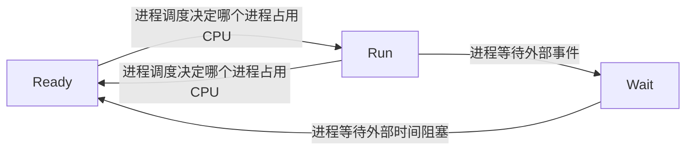
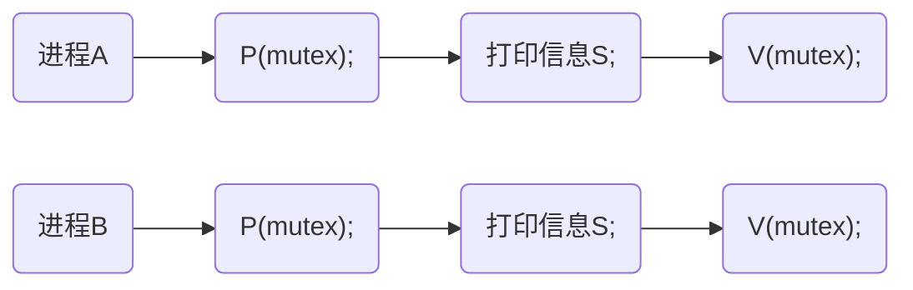
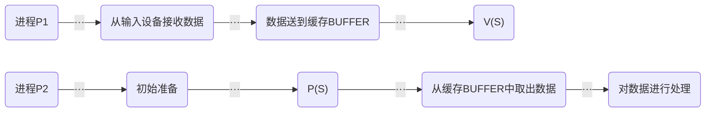

# 操作系统
## :apple:进程管理

PCB：进程控制块

TCB：线程控制块

### 进程的状态

进程由三种基本状态：**运行状态**（Run）、**就绪态**（Ready）、**等待态**（Wait）



进程由两种辅助状态：初始态、终止态

### 进程调度

#### 可剥夺调度

可剥夺调度方式又称为可抢占方式，这种方式分为两种情况。一种情况是当进程征战用处理机运行时，如果系统中出现更为“紧迫或重要”的进程，则立即停止正在运行的进程，将其转为就绪状态，然后把处理机分配给更为“紧迫或重要”的进程。另一情况是运行态进程以用完系统规定的使用处理机的时间片，系统将终止该进程的运行，将其转换为就绪状态，然后把处理机分配给下一个就绪进程。

剥夺原则包括：
- 优先级原则：优先级高的进程可以剥夺优先级低的进程占有的CPU。
- 短进程优先原则：当到达的进程比正在执行的进程明显的短时，将剥夺长进程的执行而优先执行短进程。
- 时间片原则：每个进程被分配一个同样的时间片，时间片用完后重新调度。
- 强制性剥夺：极其重要的进程或人工干预，强制引起调度。

#### 非剥夺调度

与剥夺调度方式对应的非剥夺调度方式，非剥夺调度方式又称不可抢占方式。这种方式是指系统一旦把处理机分配给某个进程使用后，则该进程就一直占用处理机运行下去，而不管有没有“紧迫或重要”的进程出现。

#### 进程调度的原则

- 公平性原则：应当保证每个进程获得合理的CPU份额，不要导致某些进程长期占用CPU，某些进程长期等待CPU。
- 有效性原则：CPU资源应该得到最大限度的利用。
- 友好性原则：响应时间快，与用户交互的时间应尽可能地短。
- 快捷性原则：周转时间短，批处理作业的处理时间尽可能地短。
- 广泛性原则：吞吐量大，单位时间内完成的作业尽可能地多。

#### 进程调度算法

- 先来先服务调度算法（FCFS）：按照作业提交或进程变为就绪状态的先后次序分配CPU。
- 优先数法：按照某种原则对就绪队列中的每个进程赋予一个优先级，进程调度时则根据进程的优先级确定选择顺序，即把处理机分配给就绪队列中优先级高的进程。
  - 静态优先数法：在进程创建时就赋给它一个优先数，进程在整个生命周期内其又优先数不在变化。
  - 动态优先数法：给进程赋予某个优先数后，在进程的生命周期内根据进程特性的动态变化、各进程对处理机使用的轻重缓急修改其优先数，即进程的优先数不是一成不变的而是根据某种原则在动态地变化着。
- 时间片轮转法：将系统中所有的就绪进程按照FCFO原则排成一个队列，每次调度时将CPU分配个队首进程，让其执行一个时间片，时间片的长度从几毫秒到几百毫秒。一个时间片结束时，发生时钟中断。调度程序据此暂停当前进程的执行，将其送到就绪队列的队尾。如此重复，是就绪队列中的所有进程依次轮流占用处理机运行。
- 多队列反馈法：将就绪进程按照优先级排成多个队列，同队列的进程就有相同的时间片，高优先级队列的时间片比低优先级队列的小。调度时先从高优先级队列中选出某一进程投入运行，当该进程的时间片到期后则转至低一级的就绪队列中。只有高优先级队列为空时才能从低一级队列中调度进程。

### 进程同步和互斥

进程的同步：进程见为了完成一个共同的目标，必须互相合作的协同工作、有先后次序的直接制约关系成为进程的同步。

进程的互斥：多个进程因不能同时访问临界资源而产生的间接制约关系称为进程的互斥。

#### 信号量

信号量的值是由一定意义的，它与相应资源的使用情况有关。当它的值大于等于0时，表示当前可用资源的实体个数。当它的值小于0时，其绝对值表示等待使用该资源的进程个数，即在该信号量队列上排队的PCB的个数。

#### P、V 操作

- P(S) 顺序执行下述两个动作
  - 如果信号量的值减1，即S=S-1。
  - 如果S$\geq$0，则该进程继续执行；如果S$<$0，则把该进程置为等待态并将该进程PCB送入到信号量的等待队列末尾。 
- V(S) 顺序执行下述两个动作
  - S值加1。
  - 如果S$>$0，则该进程继续运行；如果S$\leq$0，则释放S信号量队列上的第一个PCB（即信号量指针项指向的PCB）所对应的进程（把等待态改为就绪态），执行V操作的进程继续运行。

#### 使用P、V操作原语实现进程的互斥

如下图所示


#### 使用P、V操作原语实现进程的同步

如下图所示



#### 经典进程同步互斥问题

##### 生产者——消费者模型
生产者——消费者问题描述如下：
```
生产者进程Pi:
while(TRUE){
    生产一个产品
    P(empty);           /*申请空缓冲区*/
    P(mutex);           /*申请进入临界区*/
    产品送往缓冲区          
    V(mutex);           /*离开临界区*/
    V(full);            /*占用缓冲区个数增加1*/
}

消费者进程Ci:
while(TRUE){
    P(full);            /*申请占用缓冲区*/
    P(mutex);           /*申请进入临界区*/
    从缓冲区取出一个产品
    V(mutex);           /*离开临界区*/
    V(empty);           /*空缓冲区个数增加1*/
    消费一个产品
}
```
##### 哲学家就餐问题


```
begin
S1, S2, S3, S4, S5: semaphore;
S1:=1; S2:=1; S3:=1; S4:=1; S5:=1
cobegin
    PROCESS P1
        begin
        L1: {思考};
        P(S1)
        {取f1};
        P(S2);
        {取f2};
        {就餐};
        {放下f1和f2};
        V(S1);
        V(S2);
        Goto L1
        end;
    PROCESS P2
        begin
        L2: {思考};
        P(S2)
        {取f2};
        P(S3);
        {取f3};
        {就餐};
        {放下f2和f3};
        V(S2);
        V(S3);
        Goto L2
        end;
    PROCESS P3
        begin
        L3: {思考};
        P(S3)
        {取f3};
        P(S4);
        {取f4};
        {就餐};
        {放下f3和f4};
        V(S3);
        V(S4);
        Goto L3
        end;
    PROCESS P4
        begin
        L4: {思考};
        P(S4)
        {取f4};
        P(S5);
        {取f5};
        {就餐};
        {放下f4和f5};
        V(S4);
        V(S5);
        Goto L4
        end;
    PROCESS P5
        begin
        L5: {思考};
        P(S5)
        {取f5};
        P(S1);
        {取f1};
        {就餐};
        {放下f5和f1};
        V(S5);
        V(S1);
        Goto L5
        end;
coend;
end;
```
### 银行家算法(Banker's Algorithm)
> 参考：[银行家算法_维基百科](https://zh.wikipedia.org/wiki/%E9%93%B6%E8%A1%8C%E5%AE%B6%E7%AE%97%E6%B3%95)

银行家算法是一个避免死锁的著名算法，是由艾兹赫尔·韦伯·迪杰斯特拉在1965年为T.H.E系统设计的一种避免死锁产生的算法。它以银行借贷系统的分配策略为基础，判断并保证系统的安全运行。

在银行中，客户申请贷款的数量是有限的，每个客户在第一次申请贷款时要声明完成该项目所需的最大资金量，在满足所有贷款要求时，客户应及时归还。银行家在客户申请的贷款数量不超过自己拥有的最大值时，都应尽量满足客户的需要。在这样的描述中，银行家就好比操作系统，资金就是资源，客户就相当于要申请资源的进程。

### 进程间通信(IPC, Inter-Process Communication)
> 参考：[进程间通信_维基百科](https://zh.wikipedia.org/wiki/%E8%A1%8C%E7%A8%8B%E9%96%93%E9%80%9A%E8%A8%8A)

进程是计算机系统分配资源的最小单位（严格来说是线程）。每个进程都有自己的一部分独立的系统资源，彼此是隔离的。为了使不同的进程能够相互访问资源并进行协调工作，才有了进程间通信。

| 方法           | 提供方                                               |
| -------------- | ---------------------------------------------------- |
| 文件           | 多数操作系统                                         |
| 信号           | 多数操作系统                                         |
| Berkeley套接字 | 多数操作系统                                         |
| 消息队列       | 多数操作系统                                         |
| 管道           | 所有的POSIX系统，Windows                             |
| 命名管道       | 所有的POSIX系统，Windows                             |
| 信号量         | 所有的POSIX系统，Windows                             |
| 共享内存       | 所有的POSIX系统，Windows                             |
| 消息传递       | 用于MPI规范，Java RMI，CORBA，MSMQ，MailSlot以及其他 |
| 内存映射文件   | 所有的POSIX系统，Windows                             |


### 进程和线程

在引入线程的操作系统中，线程和进程具有以下关系：
- 线程是进程的一部分，它是进程内的一个执行单元。
- 在引入线程的操作系统中，资源分配的对象是进程，而不是线程。
- 在引入线程的操作系统中，调度的基本单位是线程而不是进程，即处理器是分给线程的，真正在CPU上执行的是线程。
- 进程可以并发执行，一个进程中的每个线程也可并发执行，而且在并发执行过程中，也需要协调同步。

## :banana:作业管理

### 用户接口
操作系统为用户提供了两种使用界面，即两种类型的接口：
- 一种是程序级接口，即系统调用，又称广义指令。用户可以在程序中直接使用程序调用来调用操作系统的有关功能。
- 另一种是作业控制级接口，其中有分别为脱机用户与联机用户设置了不同的接口，即系统提供的作业控制语言或键盘操作命令，用户可以使用它们向系统提出作业运行的步骤，控制作业的运行。

### 操作系统的状态及特权指令

**管态**，又称**核心态**，指处理机在执行操作系统的程序代码时所处的状态。

**目态**，又称**用户态**，指处理机在执行用户程序和其他操作系统应用程序时所处的状态。

特权指令，是指具有特殊权限的指令，由于这类指令的权限最大，所以如果使用不当，就会破坏系统或者其他用户信息。输入输出指令也作为特权指令，不允许用户直接使用。

### 作业状态

> 下面图片来自[https://zhuanlan.zhihu.com/p/30700602](https://zhuanlan.zhihu.com/p/30700602)


作业从提交给系统，直到完成任务后退出系统前，在整个活动过程中处于不同的状态。通常，作业状态分为四种：提交、后备、执行和完成。

- **提交状态**。程序员把已存储作业实体的某种介质提交给机房后，管理员正在向计算机键入其作业时所处的状态，称为提交状态。
- **后备状态**。作业信息输入到计算机系统硬盘的输入井中等待调度运行时的状态，称为后备状态。
- **执行状态**。硬盘输入井中处于后备状态的作业，被作业调度程序调度选中并装入内存中投入运行时的状态，称为执行状态。
- **完成状态**。作业正常运行结束或者因发生错误而终止时，释放其占有的全部资源，准备离开系统是的作业的状态，称为完成状态。

### 作业调度性能衡量

对于批处理系统，由于主要用于计算，对于作业的周转时间要求较高。因此，作业的平均周转时间或平均带权周转时间，作为衡量调度算法的优劣的标准。但是，对于分时系统和实时系统来说，外加平均响应时间作为衡量雕塑策略优劣的标准。

- 周转时间。作业 $i$ 的周转时间 $T_i$ 为
$$T_i = T_{ei} - T_{si}$$
其中， $T_{ei}$ 为作业 $i$ 的完成时间； $T_{si}$ 为作业 $i$ 的提交时间。对于被测定作业流中所含有的 $n(n \geq 1)$ 个作业来说，其平均周转时间为
$$T=\frac{1}{n} \sum_{i=1}^n T_i$$
一个作业的周转时间说明了该作业在系统内的停留时间，其包含两部分：一部分为等待时间，另一部分为执行时间，即
$$T_i=T_{wi}+T_{ri}$$
这里 $T_{wi}$ 主要指作业 $i$ 由后备状态到执行状态的等待时间，它不包括作业进入执行状态后的等待时间。
- 带权周转时间。作业的周转时间包含两个部分，即等待时间和执行时间。为了进一步反应调度性能，采用了带权周转的概念。带权周转时间是作业周转时间与作业执行时间的比，即
$$W_i=\frac{T_i}{T_{ri}}$$
对于被测定作业流所包含的几个作业来说，其平均带权周转时间为
$$W=\sum_{i=1}^n W_i$$
对于分时系统，除了要保证系统吞吐量大，资源利用率高之外，还应保证由用户能够容忍的响应时间。因此在分时系统中，仅仅用周转时间或带权周转时间来衡量调度性能是不够的。

### 常用作业调度算法

- 先来先服务算法(FCFS)
- 短作业优先算法(SJF)
- 最高响应比优先算法(HRN)
- 优先级算法

## :tada:内存管理

### 存储管理（内存管理）的功能

#### 内存回收与分配
回收和分配用户空间进程的内存。
#### 地址转换
**静态地址重定向**：在程序装入内存的时候，由操作系统的重定向装入程序一次完成作业的地址转换过程。

**动态地址重定向**：执行过程中进行地址转换。

#### 存储保护
**防止地址越界**：有两种方法，上下界保护和基址限长保护。基址限长保护是分页存储管理方法中的常用方式。

**存取权限控制**

#### 存储扩充

主要有覆盖（Overlay）和虚拟存储（Virtual Memory）。

### 分区存储管理
- 单一连续区存储管理：同一时间内只有一道程序在内存中执行。
- 固定分区管理：操作系统将除操作系统所占的空间之外的其他内存空间划分成若干个大小固定的存储区。
- 可变分区管理：根据作业大小动态地划分分区，所以又称为动态分区方式。

### 可变分区的内存分配算法
- 最先适应算法（首次适应算法）。从空闲区表依次查找满足的空闲区，找到一个足够的空闲区之后即停止查找。
- 最佳适应算法。最佳适应算法是将所有能够满足要求的空闲区中的最小者实施分配。
- 最坏适应算法。空闲区按照大小递减的方式排序，只查找空闲区的首项。

### 分页存储管理
页面划分由硬件实现，Intel 80386的页面大小是4K。

### 块表
页表的高速缓存

### 分段存储管理
用户将作业按照它们的逻辑结构划分为若干段。

### 虚拟存储技术
局部性原理：早在1968年Denning就提出过，程序的执行呈现出局部性规律，即在较短时间内，程序的执行仅限于某个部分，相应的，他的访问的存储空间也局限于某个区域。

所以程序设计可以多考虑用模块化的处理方案。

### 页面置换算法
- 最佳页面淘汰算法(OPT)：这是一种理论化的算法，其选择淘汰的页面是永不使用的页，或者随后很长时间不再访问的页面。
- 先进先出淘汰算法(FIFO)：先淘汰那些驻留内存时间最长的页面。
- 最近最不常用淘汰算法(LFU)：最近最不常用淘汰算法是根据在一段时间内页面被使用的次数选择可以调出的页，如果一个页面被访问的次数多，就是经常需要访问的页面，就不应该把它调出。
- 最近最久未用淘汰算法(LRU)：最近最久未用淘汰算法的基本思想是如果一页被访问了，那么它很有可能又被访问；反之，如果一个页面很久没被访问，那么它最近也不太可能会被访问。体现了程序设计的局部性原理。

### Belady现象
是指在使用FIFO的页面置换算法的时候，如果对一个进程未分配它所要求的全部页面，有时就会出现随着分配的页面数的增多，缺页率反而提高的异常现象。

### 段页存储管理

段内包含多个页面。

### 段页表存储管理
内存置换时，只会发生缺页中断，并不会出现缺段中断。

## :fire:其他内容

### 静态链接和动态链接的区别

动态链接是指在生成可执行文件时不将所有程序用到的函数链接到一个文件，因为有许多函数在操作系统带的dll文件中，当程序运行时直接从操作系统中找。

而静态链接就是把所有用到的函数全部链接到exe文件中。

动态链接是只建立一个引用的接口，而真正的代码和数据存放在另外的可执行模块中，在运行时再装入；

而静态链接是把所有的代码和数据都复制到本模块中，运行时就不再需要库了。

### 系统调用和函数调用的区别

### 孤儿进程和僵尸进程产生的原因，什么样的代码会产生僵尸进程

### 什么是高速缓存，为什么有高速缓存

### 如何保证线程安全

### 进程之间的状态切换

### 线程同步的好处

### 多核CPU如何保证一致性和顺序性